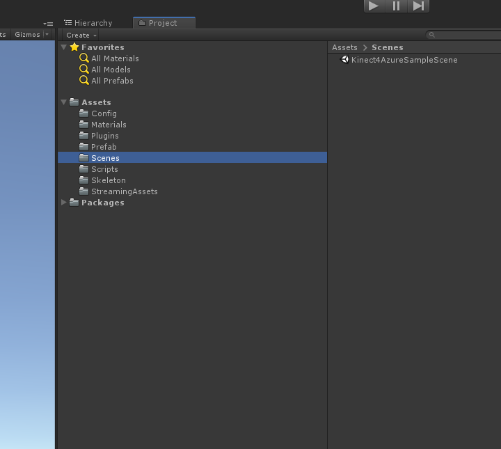

# Sample Unity Body Tracking Application

### Directions for getting started:

#### 1) First get the latest nuget packages of libraries:

Open the sample_unity_bodytracking project in Unity.
Open the Visual Studio Solution associated with this project.
If there is no Visual Studio Solution yet you can make one by opening the Unity Editor
and selecting one of the csharp files in the project and opening it for editing.
You may also need to set the preferences->External Tools to Visual Studio

In Visual Studio:
Select Tools->NuGet Package Manager-> Package Manager Console

On the command line of the console at type the following command:

Update-Package -reinstall

The latest libraries will be put in the Packages folder under sample_unity_bodytracking

#### 2) Next download the latest Body Tracking Package

Go to: https://docs.microsoft.com/en-us/azure/kinect-dk/body-sdk-download and follow the directions to install the sdk for version  1.1.0

The default location for the SDK is:   C:\Program Files\Azure Kinect Body Tracking SDK

**You can download the SDK wherever you like but you will then need to update the paths in the MoveLibraryFiles.bat file**

set BODY_TRACKING_SDK_PATH="YOUR PATH HERE"

#### 3) Next add these libraries to the Assets/Plugins folder:

You can do this by hand or just run the batch file MoveLibraryFile.bat in the sample_unity_bodytracking directory

From Wherever You Installed Azure Kinect Body Tracking SDK\sdk\netstandard2.0\release

- Microsoft.Azure.Kinect.BodyTracking.deps.json
- Microsoft.Azure.Kinect.BodyTracking.xml
- Microsoft.Azure.Kinect.BodyTracking.dll
- Microsoft.Azure.Kinect.BodyTracking.pdb

From Packages/Microsoft.Azure.Kinect.Sensor.1.4.1/lib/netstandard2.0

- Microsoft.Azure.Kinect.Sensor.deps.json
- Microsoft.Azure.Kinect.Sensor.xml
- Microsoft.Azure.Kinect.Sensor.dll
- Microsoft.Azure.Kinect.Sensor.pdb

From Azure Kinect Body Tracking SDK\tools

- cudart64_110.dll
- cublas64_11.dll
- cublasLt64_11.dll
- vcomp140.dll

From Packages/System.Buffers.4.4.0/lib/netstandard2.0

- System.Buffers.dll

From Packages/System.Memory.4.5.3/lib/netstandard2.0

- System.Memory.dll

From Packages/System.Reflection.Emit.Lightweight.4.6.0/lib/netstandard2.0

- System.Reflection.Emit.Lightweight.dll

From Packages/System.Runtime.CompilerServices.Unsafe.4.5.2/lib/netstandard2.0

- System.Runtime.CompilerServices.Unsafe.dll

From Packages/Microsoft.Azure.Kinect.Sensor.1.4.1/lib/native/amd64/release

- depthengine_2_0.dll
- k4a.dll
- k4arecord.dll

From Azure Kinect Body Tracking SDK\sdk\windows-desktop\amd64\release\bin

- k4abt.dll
- onnxruntime.dll

#### 4) Then add these libraries to the sample_unity_bodytracking project root directory that contains the Assets folder

From Azure Kinect Body Tracking SDK\tools\

- cudnn64_8.dll
- cudnn64_cnn_infer64_8.dll
- cudnn64_ops_infer64_8.dll

From Azure Kinect Body Tracking SDK\tools\

- cudart64_110.dll
- cublas64_11.dll
- cublasLt64_11.dll

From Azure Kinect Body Tracking SDK\tools\

- onnxruntime.dll

From Azure Kinect Body Tracking SDK\tools\

- dnn_model_2_0_op11.onnx

#### 5) Open the Unity Project and under Scenes/  select the Kinect4AzureSampleScene

Press play.

#### If you wish to create a new scene just:

1) create a gameobject and add the component for the main.cs script
2) go to the prefab folder and drop in the Kinect4AzureTracker prefab
3) now drag the gameobject for the Kinect4AzureTracker onto the Tracker slot in the main object in the inspector.

### Finally if you Build a Standalone Executable 
####Then you will need to put these files in the same directory with the .exe:

- onnxruntime.dll
- onnxruntime_providers_shared.dll
- onnxruntime_providers_tensorrt.dll
- dnn_model_2_0_op11.onnx
- dnn_model_2_0_lite_op11.onnx
- cudnn64_8.dll
- cudnn64_cnn_infer64_8.dll
- cudnn64_ops_infer64_8.dll
- cudart64_110.dll
- cublas64_11.dll
- cublasLt64_11.dll
- cufft64_10.dll
- directml.dll
- vcomp140.dll

