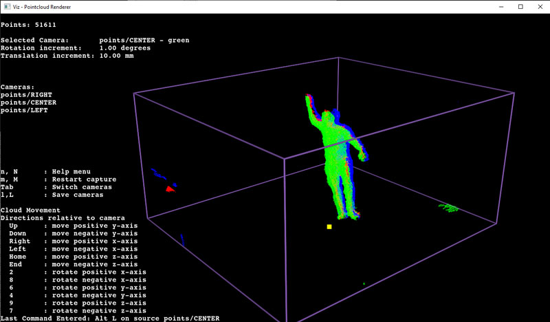
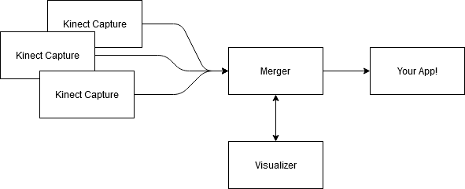

# Azure Kinect Multicamera Streaming

This example project consists of a set of applications to align multiple Azure Kinect cameras, capture depth data (point cloud frames), merge the frames from multiple cameras together, and forward them on to be consumed and rendered by third party applications like Touch Designer, Unity, or even via webGL.

## Overview of Components

This project made up of from three separate executables which communicate via the MQTT protocol.

### Kinect Capture
A console application which acquires frames from an Azure Kinect camera, performs translation/rotation of the points (to alignin multiple camers in world space) and sends the frames to the Merger to be combined with data from any other cameras in the system.

### Merger
A console application which receives frames from one or more `Kinect Capture` instances and combines them into a single frame which is broadcast to 3rd party applications for rendering.

### Visualizer 
This application is used for debugging and calibration of the system. It will display the active depth frames and provides keyboard controls to adjust the alignment of the individual `Kinect Capture` sources. This application is only used for debugging and calibration and is not typically needed once the system is set up and running.

## Usage Examples

There are three examples in this project whic render the output from this system (the merged frames).

### Unity

An example Unity project which renders the frames as dynamic particle systems using the new Visual Effects graph.

### TouchDesigner

A custom Touch Designer plugin and example network to render frames as particles.

### WebGL (THREE.js)

A simple node.js application which creates a bridge between MQTT and websockets to send frames to a web browser and render them via THREE.js.

## Documentation

You will find a README file in each project and example within this repository. Additionally, the following documents are available:

 * [Setting Up](./docs/setup.md)
 * [Networking and Binary Message Structure](./docs/networking.md)
 * [Building and Development Environment](./docs/building.md)
 * [Troubleshooting](./docs/troubleshooting.md)