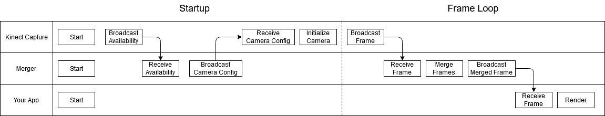
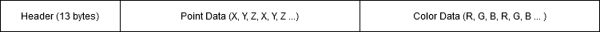

# Networking

This system communicates via MQTT. This includes the stream of depth frames as well as control signals for camera calibration. Each application must be configured with the address and port of an available MQTT broker (such as [mosquitto](https://mosquitto.org/)).

**NOTE:** Due to the high bandwith requirements it is strongly recommended that you run an MQTT broker on your local network and use wired connections rather than WIFI.


# Startup Sequence

When starting up the different components of the system, some configuration data needs to be exchanged between the `merger` and `Kinect Capture` applications (such as the MQTT topic upon which frames will be broadcast, and the camera settings like resolution and frame rate).

 Once this startup sequence is complete, frames will be sent from the `Kinect Capture` application (or applications, if there are multiple instances running). These frames will be combined by the `merger` and broadcast to other applications to be rendered.

The following diagram illustrates this startup sequence with a single `Kinect Capture` instance, but this same sequence follows for multiple cameras as well.




# Point Cloud Message Structure

Each camera frame consists of a small header followed by the 3D points, then the optional RGB color data.




## Message Header

The first 13 bytes of each frame are the header

| Bytes     | Data Type | Description |
| --------- | --------- | ----------- |
| 0 - 7     | unsigned 64 bit integer | Frame time stamp |
| 8 - 11    | unsigned 32 bit integer  | The number of points in the frame |
| 12        | unsigned 8 bit integer   | Treated as a boolean, indicates if color data is present |


## Message Body

After the header, the remaining contents in the message will be the 3D position of each point, optionally followed by the RGB color of each point (byte 12 of the header indicates if color data is present or not).

Each point position consists of three 16 bit signed integers (the X, Y, and Z coordinates, in millimeters). Therefore each point will occupy 6 bytes of space in the message body.

If color data is present, each point will include 3 bytes of color data representing the red, green, and blue values for the point. As illustrated in the message structure diagram, the message body will contain _ALL_ of the 3D position data in one contiguous block, optionally followed by _ALL_ of the RGB color data.

If color data is present, you can compute the byte offset where color data begins in the message by the following formula:

```color data byte offset = 13 + (point count * 6)```

Once you have computed the byte offset you can begin reading the RGB color values from that point in the message.