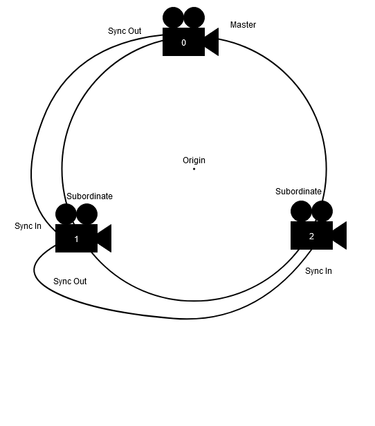

# Azure Kinect Point Cloud Streaming
This project will capture and merge 3D points (including RGB color for each point) from multiple Azure Kinect cameras and broadcast the resulting point cloud via MQTT for use in other applications.

## Applications

The system is comprised of three applications.

### Kinect capture
This application connects to the Azure Kinect to read the depth data, applies translation, rotation, and min/max thresholding, then sends the point data to the Merger. There should be one instance of this app for each Azure Kinect.

`kinect capture\kinect capture.exe`

### Merger
The merger application receives depth data from one or more capture instances and combines the points into single frames, then broadcasts the resulting merged set of points out over MQTT to be used in 3rd party applications.

`merger\merger.exe`

### Viewer
This application is used to preview the merged point cloud and adjust the relative alignment of data from multiple cameras. The viewer application is only needed for debugging and configuration/calibration. Once the system is set up correctly this application is not needed for normal use.

`viewer\Mqtt visualizer.exe`

## Prerequisites

The following components must be installed in order for these applications to work correctly:

### MQTT Broker

These applications communicate via MQTT so they will need to connect to an MQTT broker such as [Mosquitto](https://mosquitto.org/download/). The bandwidth required may be quite high so it is recommended to run a dedicated broker on a local wired network.

## Startup (Single Kinect)

1) Verify that your MQTT broker is running, this can be on the local computer or a remote computer so long as the network can handle a high volume of traffic (a dedicated wired network is recommended).

2) Plug in the Azure Kinect.

3) Run the `merger` application.

4) Run the `kinect capture` application.

5) Run the `visualizer` application.

## Startup (Multiple Kinects)

To run the system with multiple Azure Kinect cameras:

This process is very similar to running one Azure Kinect at the same time, with a few extra initial steps.

Example of cameras following the naming structure of `camera0`, `camera1`, `camera2`.

1) Verify that your MQTT broker is running, this can be on the local computer or a remote computer so long as the network can handle a high volume of traffic (a dedicated wired network is recommended).

2) The cameras need to have their plastic housing removed in order to expose the 'Sync In' and 'Sync Out' 3.5mm jacks at the back of the Azure Kinect cameras.

3) Plug in the Azure Kinects into the system. It is recommended to run all of the cameras and the merger on the same machine if possible for the best results.

4) Identify the ordering of the Azure Kinects in regards to the system, this can be done by running one of the 3 (camera0, camera1, camera2) programs and look for a white led to come on in the front of the camera.

5) The cameras will be ordered as the following camera0, camera1, and camera2. Take note where each of the cameras are in the circle and what number they are.

6) camera0 will be the master camera that each of the other cameras will start at the same time. Camera0 will be the camera that has only the 'Sync Out' jack plugged in with a 3.5mm cord.

7) That cable that comes out of camera0's 'Sync Out' jack will go into the 'Sync In' jack of camera1. Then there will be another cable plugged in to camera1's 'Sync Out' jack.

8) The cable that comes out of camera1's 'Sync Out' jack will go into the 'Sync In' jack of camera2.

9) Once all of the Sync jacks have been properly plugged in, the process is almost identical to get them running when comparing to a single camera.

10) Run the `merger` application.

11) Run the `kinect capture` applications. It can be either order of camera2 or camera1 that gets started first or second. But camera0 must be the last camera to startup, so then the other cameras receive the start signal that camera0 (the master) will send when starting up.

12) Run the `visualizer` application.

You should see a 3D preview of the points in the Visualizer window. If you do, the system is working and the point cloud data is being broadcast correctly on the MQTT topic `'points/merger'`.