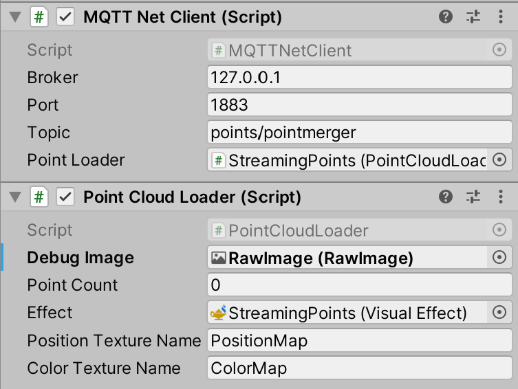

# Unity Visualizer

This is an example of consuming live point cloud frames for use with Unity. This example will receive point cloud frames and will update a VFX Graph.

## Prerequisites

* The Kinect Capture and Merger applications
* An MQTT broker such as [Mosquitto](https://mosquitto.org)
* Unity 2019.3 with Visual Effects Graph package

Please note, this has only been tested on Windows 10 64bit

## Installation

1. Configure and run the Kinect Capture and Merger apps with at least one camera attached
1. Open Unity and load the project in this folder
1. Update project settings to have "allow unsafe" checked (https://docs.unity3d.com/Manual/class-PlayerSettingsStandalone.html#Other)

## Configuration
The example includes a prefab called StreamingPoints. This prefab has all the components needed to display a streaming point cloud.

| Component | Property | Description | 
| -------- | -------- | ----------- |
| MQTT Net Client | Broker | IP address of mqtt broker |
| | Port | Network port the mqtt broker listens on |
| | Topic | MQTT topic the Merger broadcasts on |
| | Point Loader | Reference to PointCloudLoader script |
| Point Cloud Loader | Debug Image | (Optional) Reference to Raw Image |
| | Point Count | Amount of points in most recent package |
| | Effect | Reference to Visual Effect Graph |
| | Postion Texture Name | Name of the VFX graph input param for P data |
| | Effect | Name of the VFX graph input param for color data |

# License
This example uses the MQTTnet library which is release under the MIT Library
https://github.com/chkr1011/MQTTnet#license