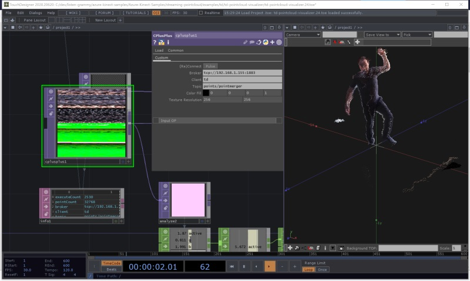
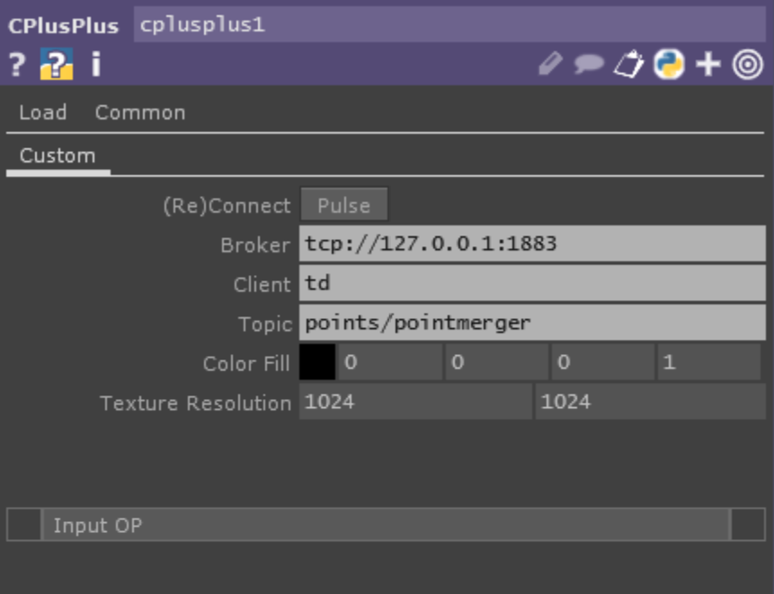

# TouchDesigner Example



This is an example of consuming live point cloud frames for in TouchDesigner. The example consists of a sample project that demonstrates using a custom c++ TOP plugin to consume the merged MQTT data stream as well as the TOP source code.


A custom c++ TOP processes the mqtt data into a texture TouchDesigner can use to visualize the pointcloud. The example comes with a comp.


## Prerequisites

1. The Kinect Capture and Merger applications
1. An MQTT broker such as [Mosquitto](https://mosquitto.org)
1. TouchDesigner latst version 2020.20020

## Installation

1. Configure and run the Kinect Capture and Merger apps with at least one camera attached
1. Open td-pointcloud-visualizer/td-pointcloud-visualizer.toe in TouchDesigner

if you want to use the TOP in your own TouchDesigner project, copy over the precompiled dll td-pointcloud-visualizer/resources/MqttToTex.dll


## Configuration



| Property | Description | 
| -------- | ----------- |
|Broker|Url to broker, usig this format tcp://[ip]:[port]|
|Client|Mqtt client id, this should be unique, if you run more than one TD instance be sure that each instance has its own unique id|
|Topic|Mqtt topic to subscribe to, this match what the merger publishes on|
|Color Fill|Color to use when there is no color data in the mqtt packet|
|Texture Resolution|Output resolution of the texture. The more points in a packet the larger this needs to be. The plugin packs color and depth into one texture. A 512 x 512 texture has a max of 131072 points. (512*512)/2.|

## Compiling from Source

The TOP plugin has the following dependencies:
1. Visual Studio 2019 with toolset v142
1. vcpkg
1. paho-mqttpp3 c++ libarry
1. Ws2_32.Lib

Note: TouchDesigner has a native mqtt library based on paho-mqtt, the same we are using in the TOP. The built in mqtt functionality does not perform for large binary packets which is one of the reasons we need a custom cpp TOP. The paho-mqtt lib TD includes is not compiled for shared multi-threaded use. The work around is to build our "own" library as a static linked library, it gets compiled into the mqtttotex.dll. 

To build from source:
1. Install/Verify Visual Studio 2019 with c++ toolset v142 
1. Install and configure vcpkg, see [../../docs/building.md] for instructions
1. Build paho-mqttpp3
    1. copy `x64-windows-static-md.cmake` to `vcpkg\triplets`
    1. ```.\vcpkg.exe install paho-mqttpp3:x64-windows-static-md```
	1. ```.\vcpkg integrate install```
1. Open solution in Visual Studio and build

Be sure to point your TouchDesigner project at the MqttToTex.dll you just built. The example project comes with a precompiled dll you need to manually overwrite.

# License
The Paho MQTT library is released under the Ecplipse Public License.
https://github.com/eclipse/paho.mqtt.cpp