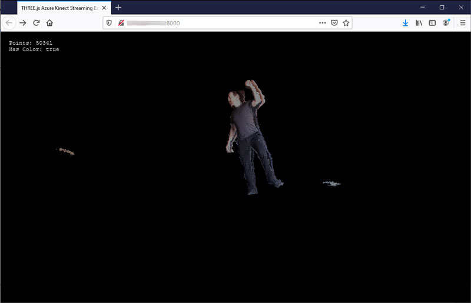

# THREE.js Visualizer

This is an example of consuming live point cloud frames for use with THREE.js. When run in a web browser, this example will receive point cloud frames and will update a THREE.BufferGeometry to be rendered via the THREE.PointsMaterial and THREE.Points object.

In order to receive frames in the browser, an intermediary server is needed to translate the MQTT messages into websocket messages. If you use an MQTT broker with built-in websocket support you will not need to translate between MQTT and websockets.

## Prerequisites

* The Kinect Capture and Merger applications
* An MQTT broker such as [Mosquitto](https://mosquitto.org)
* [Node.js](https://nodejs.org/)

## Installation

1. Configure and run the Kinect Capture and Merger apps with at least one camera attached
1. Run `npm install` to install the required node modules

## Running the Example

1. Run `node app.js` to start the local webserver with socket.io
1. Open `http://localhost:5500` in a webGL capable browser

## Configuration

The node.js application will read `config.json` at startup to load the HTTP server and MQTT broker configuration.
